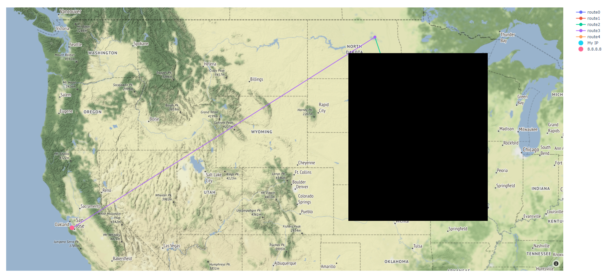

# traceroute-maps
This project obtains a list of IP addresses along a route using traceroute. Then, a name resolver retrieves the domain information based on the list of IP addresses. Usually, the resolved domain information will include location as either an address and/or latitude longitude. The retrieved latitude and longitude is plotted on a map, which visually represents the physical route used to reach a ip address or domain name.

Below shows an example of the produced map. Note, the first few locations are redacted for privacy.

<p align="center">
  
</p>

## Further Suggested Changes
Currently, this tool uses ipapi to retrieve the domain information. The ipapi website has a paid and free version. The free version, which is used by this tool, will lock access after a relatively small number of retreival requests. The website then will prevent the ip address, or MAC address, from retreiving whois results for a short while. Attempts to use the tool during this time will not produce a result, as the tool breaks. Future iterations of this tool should instead directly query available Whois servers to get the domain information, or go through a public website such as icann.org. The websites or whois servers may not produce quite as friendly of a format as ipapi, so this will require extra engineering. 

Summary:
* Change how the tool retreives whois data

## Installation

```
pip install -r requirements.txt
```

## Run

```
python main.py [ip/hostname/domain]
```
